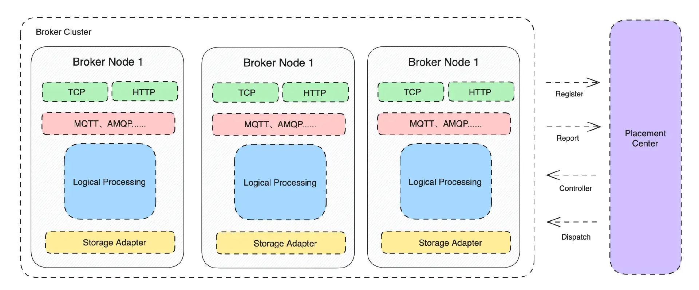

Broker Server是计算层组件，主要完成各种不同消息协议的数据接入及其相关功能的实现。从设计角度来看，它希望支持MQTT 3.1/3.1.1/5.0、AMQP、RocketMQ Remoting/GRPC、Kafka Protocol、OpenMessing、JNS、SQS等主流消息协议。架构如下：

- Broker Server 依靠 Placement Center 完成集群组建，比如节点发现、集群元数据存储等等。
- Broker Server 中的 Node 是无状态的，只负责和客户端 SDK 交互，完成数据的写入和读取。
- Broker Node 会将自身的一些运行的元数据存储在 Placement Center(PC)，在新的Broker节点启动时，会从 Placement Center读取、加载、缓存这部分信息。
- Broker Node 启动时，会往 Placement Center集群的Leader节点注册本节点的信息。
- Broker Node 会定时向Placement Center集群发送心跳信息，一旦心跳超时，PC将会移除该节点，并将该节点执行的任务迁移到其他可用节点。
- Broker Server 支持TCP、GRPC两种协议，TCP协议用来处理各种标准消息协议（比如MQTT、AMQP等）的接入，GRPC协议用来完成集群内部的功能交互，比如Broker本身的管理、监控信息拉取等等。
- 在协议相关逻辑处理部分（Logical Processing）会完成消息队列相关功能的开发，比如死信消息，延迟消息、顺序消息等等功能。通过代码块的形式提供给不同协议使用。
- 在消息数据存储部分，是通过 Storage Adapter 来完成数据的读取和写入的。
- Broker Node 会不断地定时向 Placement Center 上报自身的运行信息。
- Placement Center 会根据Broker Node上报的运行信息以及多维度的信息来判断是否执行某些管理操作，然后调用 Broker 的GRPC接口完成对应操作。