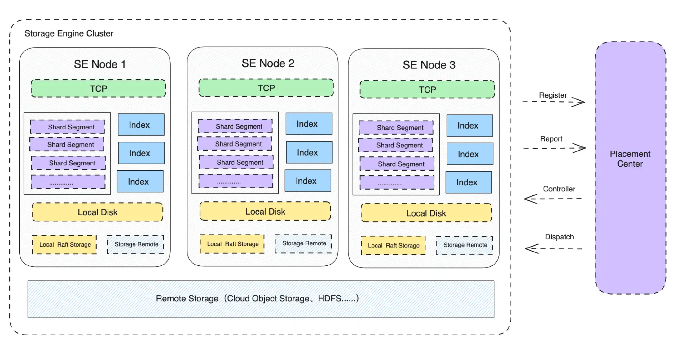

Storage Engine（后面简称SE）是独立的存储服务，它负责消息数据的持久存储，需要兼顾性能、可靠性和成本。它以GRPC 协议（GRPC协议可能会有性能瓶颈，待后续调整）的形式暴露服务。架构如下：

- SE 是一个分布式可水平扩容的集群。可通过横向添加Storage Engine Node（SEN）节点来水平扩容集群。
- SE 通过GRPC协议来提供数据面服务，以支持数据的写入和读取。
- SE 通过在PC中注册节点信息来组件集群。会通过定时上报心跳的方式来保证节点的可用性。
- SE 以分片（Shard）为单位组织数据，分片由多个数据段（Segment）组成。每个Segment的大小默认是1GB（暂定）。
- 分片（Shard）的相关元数据信息存储在Placement Center（PC）中，比如有几个Segment，Segment的分布等等。
- SE 存储层是 Local Raft Storage （LRS）模式。 分片（Shard）的不同的数据段（Segment）默认是3副本存储，不同的数据段会根据均衡算法分布在不同的节点（SEN）上。
- 同时提供分层存储的实现，即允许将Shard数据存放到远程的低成本存储引擎，比如对象存储。
- SE 的索引模块会负责构建数据的索引，如时间索引、key索引、offset索引等。